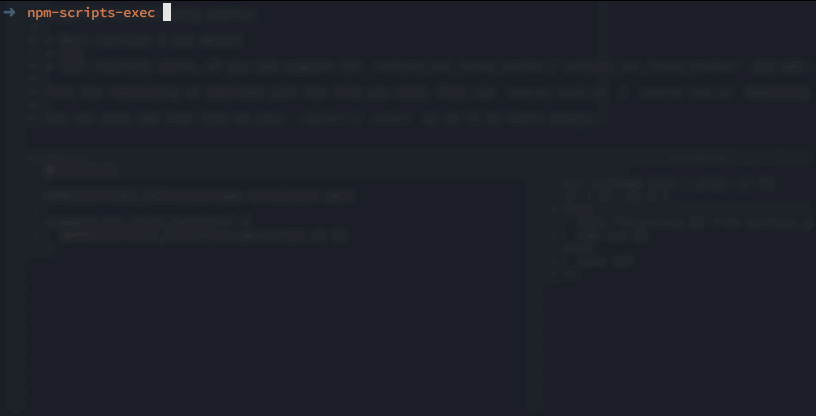

## npm-scripts-exec

npm-scripts-exec is a handy utility to make your life as a nodejs developer easier, by exposing npm scripts as normal shell commands.

Let's say you have the command `test-command` in the scripts object in the `package.json` of your project.
If you want to run this command, you would have to write `npm run test-command`.

What npm-scripts-exec does, is that it looks for the command like your shell usually does, and then checks `package.json` for that command.

So now you can just run `test-command` in your terminal directly, and it'll run `npm run test-command` for you!

Simple made easy.

## Installation

Supports the following shells:

* Bash (version 4 and above)
* Zsh
* Your favorite shell, if you add support for `command_not_found_handle`/`command_not_found_handler` and add it :)

Fork the repository or download just the file you need. Then run `source bash.sh` / `source zsh.sh` depending on which shell you use.

You can also add that line to your `.bashrc`/`.zshrc` so it'll be there always.

## Support / Help

If you have any questions, open a Github issue here:
[github.com/VictorBjelkholm/npm-scripts-exec/issues/new](https://github.com/VictorBjelkholm/npm-scripts-exec/issues/new)

or feel free to contact me on Twitter here:
[@VictorBjelkholm](https://twitter.com/VictorBjelkholm)

## License

The MIT License (MIT)

Copyright (c) 2016 Victor Bjelkholm

Permission is hereby granted, free of charge, to any person obtaining a copy of this software and associated documentation files (the "Software"), to deal in the Software without restriction, including without limitation the rights to use, copy, modify, merge, publish, distribute, sublicense, and/or sell copies of the Software, and to permit persons to whom the Software is furnished to do so, subject to the following conditions:

The above copyright notice and this permission notice shall be included in all copies or substantial portions of the Software.

THE SOFTWARE IS PROVIDED "AS IS", WITHOUT WARRANTY OF ANY KIND, EXPRESS OR IMPLIED, INCLUDING BUT NOT LIMITED TO THE WARRANTIES OF MERCHANTABILITY, FITNESS FOR A PARTICULAR PURPOSE AND NONINFRINGEMENT. IN NO EVENT SHALL THE AUTHORS OR COPYRIGHT HOLDERS BE LIABLE FOR ANY CLAIM, DAMAGES OR OTHER LIABILITY, WHETHER IN AN ACTION OF CONTRACT, TORT OR OTHERWISE, ARISING FROM, OUT OF OR IN CONNECTION WITH THE SOFTWARE OR THE USE OR OTHER DEALINGS IN THE SOFTWARE.
